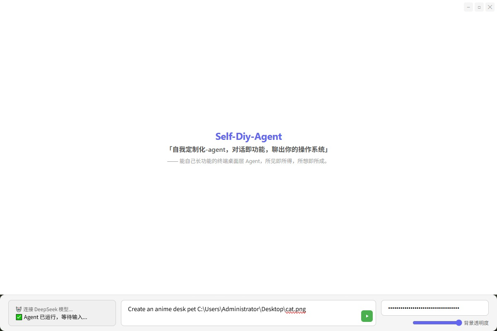
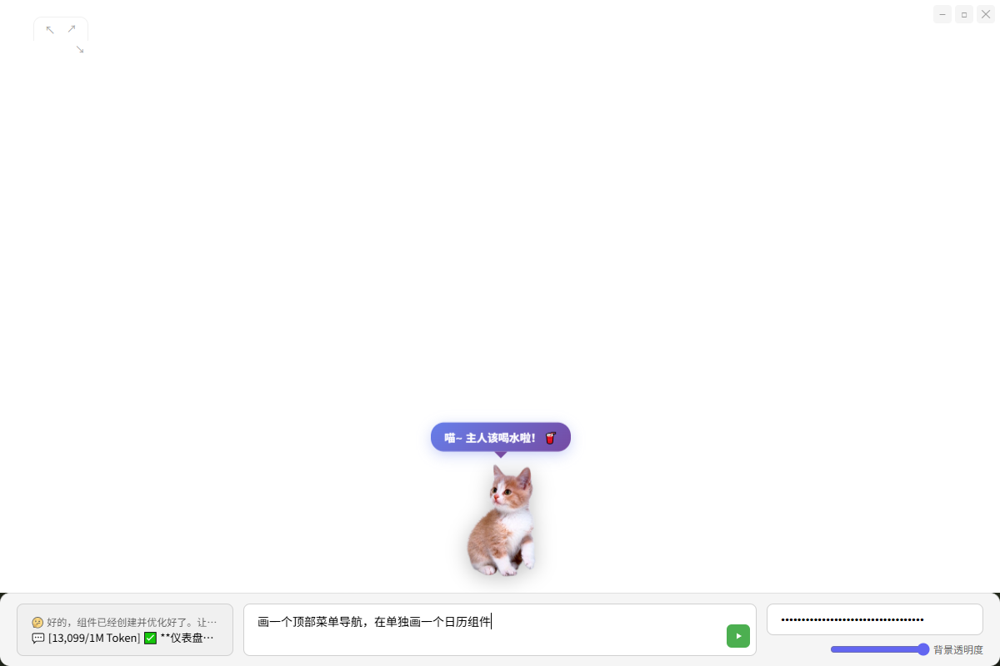
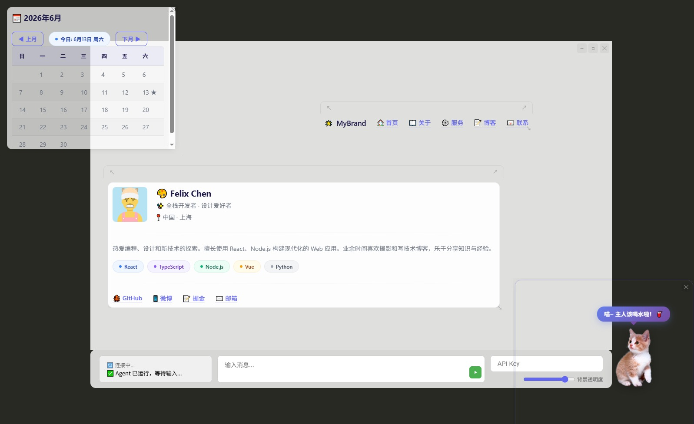

# Self-Diy-Agent (SDA) ✦

<div align="center">
  
  
  
</div>

Self-Diy-Agent | SDA

[中文](./README.zh-CN.md)

**"Self-customizing agent — conversation is function, chat your OS into existence"**

—— A terminal desktop layer agent that grows its own capabilities. What you see is what you get. What you imagine is what it becomes.

SDA is a self-growing AI shell agent. Talk to it, and it generates its own UI components, configures its own features, and morphs into whatever you need — no drag-and-drop, no coding. Built on Electron + json-render, it renders interfaces from a single sentence and launches any file or program with a double-click, running as a native transparent window like a true operating system. Use any model — OpenAI, Claude, Gemini, or your own endpoint. Switch models with zero code, zero lock-in. (Currently DeepSeek API only; multi-model switching on roadmap.)

Let AI create an anime desk pet — float, follow mouse, throw with inertia, and timed reminders!!!

SDA can serve as a customizable agent foundation.

SDA can serve as a terminal desktop agent shell.

Windows (done), macOS, Android — three systems, one customizable AI desktop layer.

| Conversation is Function | Theoretically can grow anything: tell the AI what you want → auto-generate json-render spec → real-time UI rendering in seconds |
| --- | --- |
| Anime Desk Pet | One sentence to create a PNG desk pet — float, follow mouse, throw with inertia, timed reminder bubbles |
| Terminal Shell | Electron frameless transparent window with custom drag/resize/popup, blends seamlessly into your desktop |
| File System Access | Browse local directories, double-click to open with system default apps (images/video/docs/exe) via `shell.openPath` |
| Self-Customizing | AI configures its own Skills / MCP / API Keys / Models, grows new capabilities without config files |
| Frosted Glass UI | Global opacity control, floating windows, background/component dual-channel transparency |

---

## Quick Start

### Dev | Windows (✅), macOS, Linux

Git clone the repo, then tell any agent you already have running to boot it up in Electron mode.

### Install | Windows (✅)

Download the latest `.exe` from [Releases](https://github.com/your-org/agent-ui/releases), double-click to install on Win10.

Start chatting in the input box and let the Agent generate your first UI:

```
Draw a calendar component
Create a tool list viewer component
Build a Baidu search box — enter a query, execute a Baidu search, and show the top 5 results below
Create an anime desk pet C:\Users\Administrator\Desktop\cat.png
```

---

## Quick Reference

| Action | How |
| --- | --- |
| Generate UI | Describe your need in natural language in the bottom input box |
| Pop out as floating window | Click ↗ button on component title bar |
| Close floating window | Click ✕ in top-right of content area |
| Drag component | Click any empty space in component to drag; drag top bar to move main window |
| Resize component | Drag ↖ top-left or ↘ bottom-right corner |
| Background opacity | Adjust slider in bottom-right panel |
| Quit | Click ✕ in top-right of main area |

---

## Project Structure

```
self-diy-agent/
├── electron/           # Electron main process & preload
│   ├── main.ts         # Window creation, backend child process management
│   ├── preload.ts      # preload security bridge
│   └── database.ts     # SQLite database
├── src/
│   ├── App.tsx         # Main window (drag/resize/popup/status bar/branding)
│   ├── components/
│   │   ├── ToolPanel.tsx    # json-render rendering container
│   │   └── JsonEditor.tsx   # Spec JSON editor
│   ├── lib/json-render/
│   │   ├── registry.tsx     # UI component registry (Card/Button/Table/...)
│   │   └── catalog.ts
│   └── specs/          # AI-generated UI spec JSON files
├── agent-backend/      # Agent backend (port 3001)
│   ├── .env            # API Key / model config
│   └── src/
│       ├── agent.ts    # LangChain StateGraph Agent
│       ├── index.ts    # Express server entry (routes/SSE/tool management)
│       └── tools/      # 19 tools (sqlite-* / ui-spec-* / current_time etc.)
├── 文档/               # Docs
│   ├── v2迭代计划.md   # v2 roadmap (Chinese)
│   └── 项目路径以及启动.md
├── README.md
└── README.zh-CN.md
```

---

## Tech Stack

```
Electron + React 18 + Vite 6 + json-render + LangChain + Express + SQLite
```

| Layer | Technology |
| --- | --- |
| Frontend Rendering | React 18 + json-render dynamic UI engine |
| Desktop Shell | Electron frameless transparent window + IPC |
| Agent Backend | Express + LangChain Agent orchestration |
| UI Generation | Agent generates JSON → SSE push → frontend auto-renders |
| Data | SQLite (chat history / UI spec persistence) |

---

## Roadmap

| Feature | Status |
| --- | --- |
| Win10-style file explorer (Tree + Breadcrumb + double-click launch) | Planned |
| Message history persistence & session management | Planned |
| Skill / MCP / API configuration panel | Planned |
| Agent general feature configuration | Planned |

See [v2 roadmap](./文档/v2迭代计划.md) (Chinese)

---

### Sponsor

WeChat / Alipay sponsorship QR codes are in the `assets/` directory.

<div align="center">
  
  &nbsp;&nbsp;
  
</div>

---

## License

MIT — free to use. If this project helped you, consider buying the author a coffee ☕
